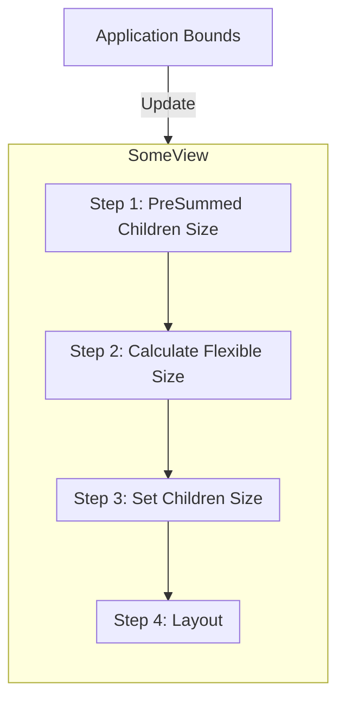

# FORMULA

## Update Layout

```mermaid
graph TB
    A[Application Bounds] -->|Update| SomeView

    subgraph SomeView
        direction TB
        S1 --> S2 --> S3 --> S4
        subgraph S1[Step 1: PreSummed Children Size]
            direction TB

        end

        subgraph S2[Step 2: Calculate Flexible Size]
            direction TB

        end

        subgraph S3[Step 3: Set Children Size]
            direction TB

        end

        subgraph S4[Step 4: Layout]
            direction TB

        end
    end
```
