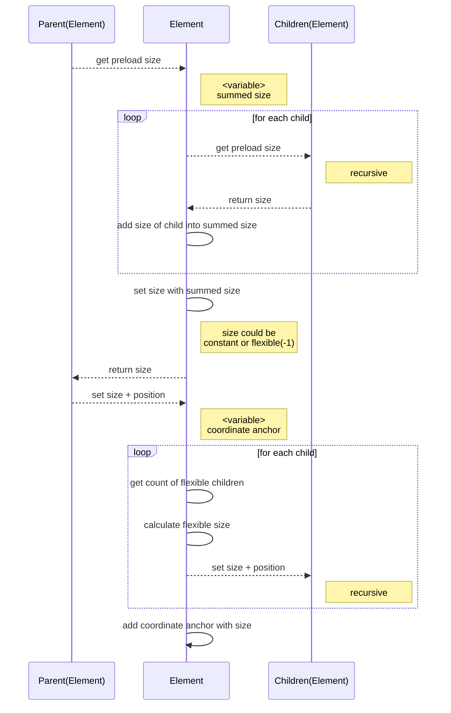
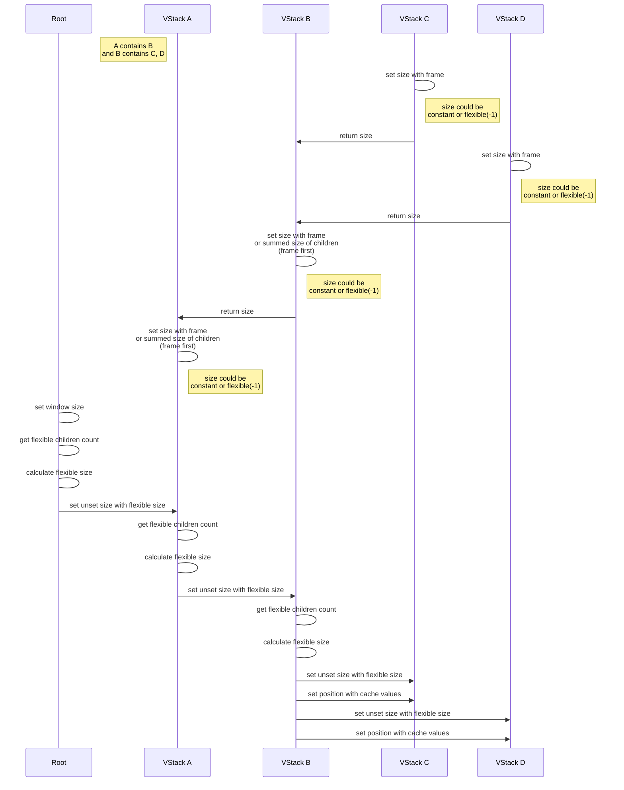

# Note

## Challenge

1. How to calculate flexible size?

   1. How to get size of SomeView?

2. How to set flexible size to views, even ?

## View

### Size

If `initSize` is `-1`, `size` will always be calculated from flexible size.

Otherwise, `size` will be calculated from init size.

## View Modifiers

#### Layout

- Frame
- BackgroundColor
- Padding
- Offset
- Shadow
- Border
- Mask
- Overlay
- Background -> Create New View

#### Action

- OnHover
- OnTapGesture
- OnChange
- OnAppear
- OnDisappear
- OnDrag
- OnDrop

#### Environment

- ForegroundColor
- Font
- FontSize
- FontWeight

#### Parameter

- CornerRadius
- LineSpacing
- Kerning
- Italic

## Size & Position Calculation Flow

#### Concept

#### Example

