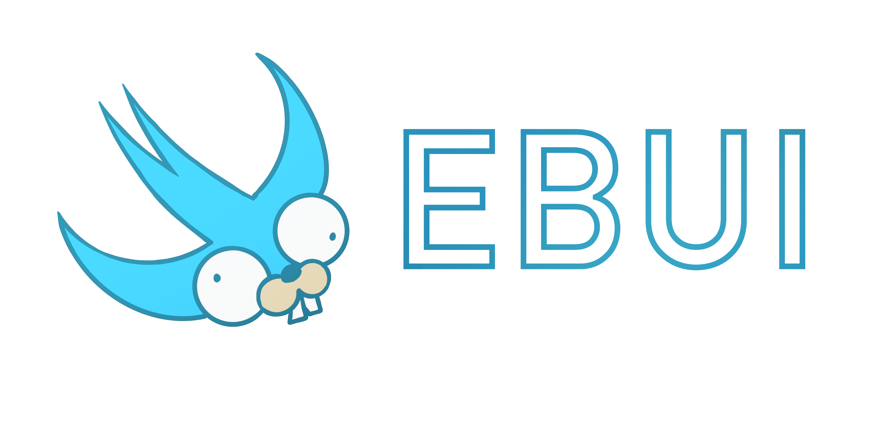

> [!IMPORTANT]
> このパッケージは現在アルファ開発段階です

<a href="."></a>

[](README.md)
[](README-tw.md)
[](README-cn.md)
[](README-ja.md)
[](README-ko.md)

EBUI は [SwiftUI](https://developer.apple.com/documentation/swiftui) にインスパイアされ、[Ebitengine](https://github.com/hajimehoshi/ebiten) フレームワークの上に構築された Go 言語用の宣言的 UI フレームワークです。クリーンで機能的な構文を使用してインタラクティブなアプリケーションを作成できます。

## 特徴

- **宣言的構文**: SwiftUI に似たクリーンな宣言的構文で UI を構築
- **データバインディング**: UI を自動的に更新する反応型プログラミングモデル
- **コンポーネントベースのアーキテクチャ**: 再利用可能な UI コンポーネントを作成
- **レイアウトシステム**: 柔軟なスタックベースのレイアウトシステム（VStack、HStack、ZStack）
- **モディファイア**: スタイルと動作をカスタマイズするためのチェーン可能なモディファイア
- **ライブプレビュー**: VSCode 統合によるリアルタイム変更プレビュー
- **クロスプラットフォーム**: Ebitengine がサポートするすべてのプラットフォームで動作
- **統合アニメーション**: スムーズな UI アニメーションのビルトインサポート
- **Ebitengine 統合**: スタンドアロンアプリとしても、既存の Ebitengine プロジェクト内でも動作

## インストール

```
go get github.com/yanun0323/ebui@latest
```

## クイックスタート

### コンテンツビューの定義

```go
import (
	ui "github.com/yanun0323/ebui"
	"image/color"
)

type contentView struct {
	title   *ui.Binding[string]
	content *ui.Binding[string]
}

func ContentView(title, content *ui.Binding[string]) ui.View {
	return &contentView{
		title:   title,
		content: content,
	}
}

func (view *contentView) Body() ui.SomeView {
	return ui.HStack(
		ui.Spacer(),
		ui.VStack(
			ui.Spacer(),
			ui.Text(view.title).
				Padding(ui.Bind(ui.Inset{0, 15, 0, 15})).
				ForegroundColor(ui.Bind[color.Color](color.White)).
				BackgroundColor(ui.Bind[color.Color](color.Gray{128})),
			ui.Text(view.content),
			ui.Spacer(),
		).Frame(ui.Bind(200.0), nil),
		ui.Spacer(),
	).
		ForegroundColor(ui.Bind[color.Color](color.RGBA{200, 200, 200, 255})).
		BackgroundColor(ui.Bind[color.Color](color.RGBA{255, 0, 0, 255})).
		Padding(ui.Bind(ui.Inset{5, 5, 5, 5}))
}
```

### スタンドアロンアプリとして実行

```go
import (
	ui "github.com/yanun0323/ebui"
	"image/color"
	"log"
)

func main() {
	title := ui.Bind("title")
	content := ui.Bind("content")
	contentView := ContentView(title, content)

	app := ui.NewApplication(contentView)
	app.SetWindowBackgroundColor(color.RGBA{100, 0, 0, 0})
	app.SetWindowTitle("EBUI Demo")
	app.SetWindowSize(600, 500)
	app.SetWindowResizingMode(ui.WindowResizingModeEnabled)
	app.SetResourceFolder("resource")

	if err := app.Run(); err != nil {
		log.Fatal(err)
	}
}
```

### Ebitengine 内で実行

```go
import (
	ui "github.com/yanun0323/ebui"
	"github.com/hajimehoshi/ebiten/v2"
	"log/slog"
	"image/color"
)

func main() {
	contentView := ui.ContentView("title", "content")
	g := NewGame(contentView)

	if err := ebiten.RunGame(g); err != nil {
		slog.Error("run game", "error", err)
	}
}

func NewGame(contentView ui.View) *Game {
	return &Game{
		contentView: contentView.Body(),
	}
}

type Game struct {
	contentView ui.SomeView
}

func (g *Game) Update() error {
	ui.EbitenUpdate(g.contentView)
	return nil
}

func (g *Game) Draw(screen *ebiten.Image) {
	ui.EbitenDraw(screen, g.contentView)
}

func (g *Game) Layout(outsideWidth, outsideHeight int) (int, int) {
	ui.EbitenLayout(outsideWidth, outsideHeight)
	return outsideWidth, outsideHeight
}
```

## 利用可能なコンポーネント

### ビュー (✓ = 実装済み)

| 基本コンポーネント                     | レイアウトコンポーネント | 入力コンポーネント                | 高度なコンポーネント               |
| -------------------------------------- | ------------------------ | --------------------------------- | ---------------------------------- |
| ✓ Text（テキスト）                     | ✓ VStack（垂直スタック） | ✓ Button（ボタン）                | ✓ ScrollView（スクロールビュー）   |
| ✓ Image（画像）                        | ✓ HStack（水平スタック） | ✓ Toggle（トグル）                | ❑ List（リスト）                   |
| ✓ Rectangle（長方形）                  | ✓ ZStack（重ねスタック） | ✓ Slider（スライダー）            | ❑ TableView（テーブルビュー）      |
| ✓ Circle（円）                         | ✓ Spacer（スペーサー）   | ❑ TextField（テキストフィールド） | ❑ Navigation（ナビゲーション）     |
| ✓ Divider（区切り線）                  | ✓ EmptyView（空ビュー）  | ❑ TextEditor（テキストエディタ）  | ❑ Sheet（シート）                  |
| ✓ ViewModifier（ビューモディファイア） |                          | ❑ Picker（ピッカー）              | ❑ Menu（メニュー）                 |
|                                        |                          | ❑ Radio（ラジオ）                 | ❑ ProgressView（プログレスビュー） |
|                                        |                          | ❑ DatePicker（日付ピッカー）      |                                    |
|                                        |                          | ❑ TimePicker（時間ピッカー）      |                                    |
|                                        |                          | ❑ ColorPicker（色ピッカー）       |                                    |

### 機能 (✓ = 実装済み)

- ✓ Modifier Stack（モディファイアスタック）
- ✓ CornerRadius（角丸）
- ✓ Animation（アニメーション）
- ✓ Alignment（配置）
- ❑ Gesture（ジェスチャー）
- ❑ Overlay（オーバーレイ）
- ❑ Mask（マスク）
- ❑ Clip（クリップ）

## VSCode でのライブプレビュー

EBUI は SwiftUI に似た開発体験を提供し、VSCode で直接 UI のリアルタイムプレビューを行うことができます。

### VSCode 拡張機能の使用

[ebui-vscode 拡張機能](https://github.com/yanun0323/ebui-vscode) は `Preview_` で始まる関数のホットリロード機能を提供します。

1. VSCode マーケットプレイスから拡張機能をインストール
2. Go ファイルに `Preview_` プレフィックスを持つ関数を作成
3. 保存するとプレビューウィンドウで UI の更新をリアルタイムに確認できる

### 例

```go
package mypackage

import (
	ui "github.com/yanun0323/ebui"
	"image/color"
)

// この関数は自動的にプレビューされます
func Preview_MyButton() ui.View {
	return ui.Button(ui.Const("クリック")).
		BackgroundColor(ui.Bind[color.Color](color.RGBA{200, 100, 100, 255})).
		Padding(ui.Bind(ui.Inset{10, 10, 10, 10})).
		Center()
}
```

### 仕組み

拡張機能の動作:

1. Go ファイルの変更を監視
2. 保存時に EBUI プレビューツールを実行
3. コード内の `Preview_` 関数を検出
4. ライブプレビューウィンドウでレンダリング

これにより、エディタを離れることなく UI 開発の高速フィードバックループが実現します。
